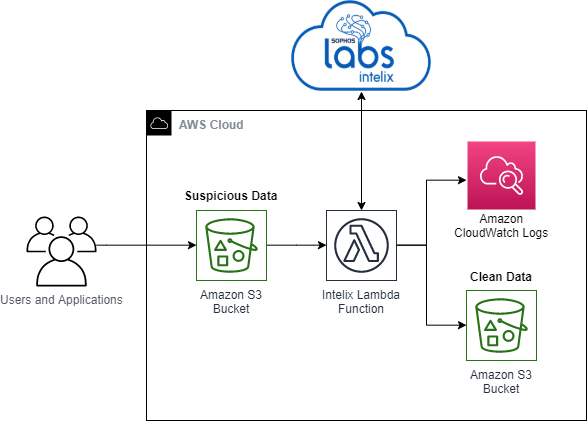

# SophosLabs Intelix AWS CDK Lambda example
## Summary
This example deploys a stack to leverage Sophos Intelix via Lambda to check files being uploaded to an S3 bucket for malware.

SophosLabs Intelix is available on AWS marketplace, details (including how to sign up) can be found [here](https://sophos.com/intelix).

This lambda function, when deployed into your AWS environment will trigger on write actions into an S3 bucket. This means that the lambda function will trigger every time a file is added to the bucket. Each of the Intelix services will be called in turn (File Hash Lookup, Static Analysis, Dynamic Analysis) until a verdict (Clean or Malicious) is determined. If the file is malicious it is removed from the bucket.

The code requires your Intelix credentials to be available as an environment variable.

* [AWS CDK](https://aws.amazon.com/cdk/) is used to deploy via infrastructure as code
* [AWS Lambda](https://aws.amazon.com/lambda/) is used to execute a serverless python function to query the Sophos Intelix API
* [AWS S3](https://aws.amazon.com/s3/) is used for our file object storage
* [Sophos Intelix](https://sophos.com/intelix) is used via API for File Hash Lookup, Static Analysis and Dynamic Analysis to determine if a file is clean or malicious

## Architecture Diagram



## Prerequisites

### Git
* Install [git](https://git-scm.com/book/en/v2/Getting-Started-Installing-Git)

### AWS

* An AWS account
* [AWS CLI](https://docs.aws.amazon.com/cli/latest/userguide/install-cliv2.html)
* AWS CLI [configured](https://docs.aws.amazon.com/cli/latest/userguide/cli-configure-quickstart.html#cli-configure-quickstart-config)
* [AWS CDK](https://docs.aws.amazon.com/cdk/latest/guide/getting_started.html)

### Configure your AWS environment

### Install AWS CDK
See the [AWS CDK Getting started guide](https://docs.aws.amazon.com/cdk/latest/guide/getting_started.htm) for more info.
```
npm install -g aws-cdk
```

## Configure AWS Credentials
CDK will pull from your AWS CLI credentials, ensure you have credentials configured along with a default region.
```
aws configure
```

### Clone repository
```
git clone https://github.com/sophoslabs/intelix-lambda-example.git
```

### Create Python Environment
```
cd intelix-lambda-example
python3 -m venv .venv
```

## Deploy

### Activate Environment
```
source .venv/bin/activate
```

### Install python dependencies
```
pip3 install -r requirements.txt
```

### Install python dependencies into the Lambda code directory
```
pip3 install requests -t ./resources
```

### Bootstrap CDK
```
cdk bootstrap
```

### Obtain Sophos Intelix Credentials

Register for Intelix and receive API credentials:
https://aws.amazon.com/marketplace/pp/B07SLZPMCS

### Pass Intelix Crednentials to Lambda

In our example, we will use a Lambda environment variable to pass our Intelix Credentials to Lambda. In a production setup, you may prefer to use [AWS Secrets Manager](https://aws.amazon.com/secrets-manager/) to securely store your credentials.

Edit the file:
```
cdk_intelix_lambda/intelix_lambda_service.py
```

Add your base64 encoded Intelix credentials to the line containing:
```
INTELIX_CREDENTIALS="<YOUR BASE64 CODED CLIENT_ID:CLIENT_SECRET>"
```

### Synth template
```
cdk synth
```

### Deploy
```
cdk deploy
```

## Development / Contributing Guidelines
[](https://gitpod.io/#https://github.com/sophoslabs/intelix-lambda-example.git)

This repo is setup to use Gitpod.  This will ensure your environment is configured with the required packages / dependancies etc.

To run the tests for this repo:
  1. Ensure that you have provided your Intelix key in the form ready to be sent to the login function as an environment variable (INTELIX_CREDENTIALS).
  (Details of the format are available in the [Intelix docs](https://api.labs.sophos.com/doc/authentication.html))
  2. Run (in the root directory of the repo) `pytest`

Copyright (c) 2021. Sophos Limited
